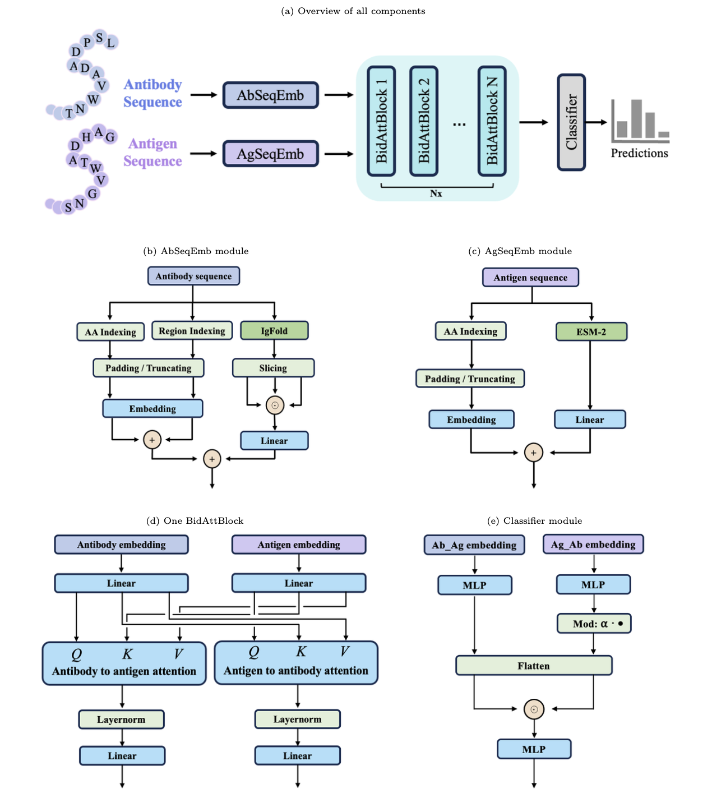

# AntiBinder
AntiBinder: 항체-항원 결합 관계를 예측하기 위한 양방향 교차 주의 메커니즘 기반 서열-구조 하이브리드 모델. 이 버전은 예측 정확도 향상을 위해 **중쇄(VH)**와 **경쇄(VL)** 데이터를 모두 지원합니다.



## 소개
이 프로젝트는 단백질 유형에 대한 항원-항체 친화도를 예측하는 데 사용됩니다. 이 모델은 서열 데이터만으로도 훈련되고 사용될 수 있습니다. 내부 모듈들을 스택할 수 있어 모델의 매개변수를 크게 늘릴 수 있으며, 플러그 앤 플레이 효과를 달성할 수 있도록 훈련할 수 있습니다. 업데이트된 모델은 더 포괄적인 결합 예측을 위해 항체의 VH와 VL 영역을 모두 활용합니다.

## 의존성
python 3.11

## 설치 가이드
프로젝트를 설치하고 설정하는 방법에 대한 자세한 지침:

### 저장소 복제
```bash
git clone https://github.com/brisingr10/Antibinder3.git
```

### 의존성 설치
```bash
pip install -r requirements.txt
```

## 사용 지침

### 1. 데이터 준비
훈련이나 예측 전에, raw 항체-항원 결합 데이터를 처리하여 관련 영역을 추출하고 단일 데이터셋으로 결합해야 합니다.

**단계:**

1.  **Raw 데이터 처리:**
    `process_all_data.py`를 사용하여 다음을 포함한 모든 필요한 데이터 전처리를 수행합니다:
    *   `datasets/raw_data/`에서 raw 데이터 읽기.
    *   알려진 데이터셋에 대한 내부 구성을 기반으로 열 이름 변경 (예: `Heavy`를 `vh`로, `Light`를 `vl`로, `antigen`을 `Antigen Sequence`로, `Label`을 `ANT_Binding`으로).
    *   VH와 VL 서열을 각각의 프레임워크(FR)와 CDR 세그먼트(H-FR1, H-CDR1 등, L-FR1, L-CDR1 등)로 단일 결합 파일에서 분할.
    *   모든 처리된 데이터 파일을 단일 데이터셋으로 결합.
    *   데이터 검증 수행 (VH 또는 VL 서열이 누락된 행과 중복 제거).
    *   결합된 데이터를 훈련과 검증을 위한 `training_data.csv`와 `test_data.csv`로 분할.

    `datasets/raw_data/`의 raw 데이터 CSV 파일에 `process_all_data.py`에서 예상하는 VH, VL, 항원 서열, 결합 라벨에 대한 필요한 열이 포함되어 있는지 확인하세요 (각 데이터셋에 대한 특정 열 매핑은 스크립트의 `if __name__ == "__main__":` 블록을 참조).

    ```bash
    python process_all_data.py
    # 이 스크립트는 datasets/raw_data/에서 읽어와서 datasets/process_data/에 처리된 파일을 생성하고,
    # 최종 training_data.csv와 test_data.csv를 datasets/ 디렉터리에 저장합니다.
    ```

    **출력 데이터 구조:**
    `training_data.csv`와 `test_data.csv` 파일은 다음 열들을 포함합니다:
    `vh`, `vl`, `Antigen Sequence`,
    `H-FR1`, `H-CDR1`, `H-FR2`, `H-CDR2`, `H-FR3`, `H-CDR3`, `H-FR4`,
    `L-FR1`, `L-CDR1`, `L-FR2`, `L-CDR2`, `L-FR3`, `L-CDR3`, `L-FR4`,
    `ANT_Binding`

### 데이터 구조 세부사항

훈련 데이터는 다음 주요 구성 요소를 가진 항체-항원 결합 쌍으로 구성됩니다:

**항체 구조:**
- **VH**: 완전한 VH 서열을 포함
- **VL**: 완전한 VL 서열을 포함  
- **CDR/FR 영역**: 각 체인은 7개 영역으로 분할됩니다:
  - 프레임워크 영역 (FR1, FR2, FR3, FR4): 구조적 골격 영역
  - CDR (CDR1, CDR2, CDR3): 항원 결합 영역
  - CDR3는 일반적으로 가장 가변적이며 결합 특이성에 중요합니다

**항원 구조:**
- **항원 서열**: 표적 단백질의 완전한 아미노산 서열
- 다양한 소스에서 나올 수 있습니다 (바이러스 단백질, 종양 항원 등)

**결합 라벨:**
- **ANT_Binding**: 이진 분류 (0 = 결합 안 함, 1 = 결합)
- 연속적인 결합 친화도 값을 가진 데이터셋(delta_g 등)의 경우, 이진 라벨로 변환하기 위해 임계값이 적용됩니다

**데이터 소스:**
- **CoV-AbDab**: SARS-CoV-2 결합 데이터를 가진 COVID-19 항체 데이터베이스
- **BioMap**: 열역학적 측정을 가진 항체-항원 결합 친화도 데이터셋
- 동일한 구조를 따라 추가 데이터셋을 추가할 수 있습니다

### 2. 모델 훈련
데이터가 준비되고 결합되면, `main_trainer.py`를 사용하여 AntiBinder 모델을 훈련할 수 있습니다.

```bash
python main_trainer.py \
    --batch_size 32 \
    --latent_dim 32 \
    --epochs 50 \
    --lr 1e-4 \
    --model_name AntiBinderV2 \
    --device 0 # 사용 가능한 경우 CUDA 디바이스 지정, 예: 0, 1 등.

# 기타 선택적 인수들:
# --no_cuda: CUDA 훈련 비활성화 (CPU 사용)
# --seed: 재현성을 위한 랜덤 시드 (기본값: 42)
```

*   **구성:** 모델 매개변수와 아키텍처 구성 (예: VH와 VL에 대한 `max_position_embeddings`, 영역 유형 인덱싱)은 `cfg_ab.py`에 정의되어 있습니다.
*   **데이터 로딩 & 임베딩:** `antigen_antibody_emb.py` 스크립트는 결합된 데이터 로딩, 항원에 대한 ESM 임베딩 생성, 항체 체인에 대한 IgFold 구조 임베딩을 처리합니다. 또한 효율적인 데이터 검색을 위한 LMDB 캐시도 관리합니다.

### 3. 모델로 예측하기
훈련된 모델을 사용하여 예측을 수행하려면 `main_test.py`를 사용하세요. 스크립트는 자동으로 데이터 전처리를 처리하며, 다음 중 하나를 제공할 수 있습니다:
- **Raw 데이터**: `vh`, `vl`, `Antigen Sequence` 열만 있는 CSV (자동으로 CDR/FR 영역으로 분할됩니다)
- **전처리된 데이터**: 이미 CDR/FR 영역을 포함하는 CSV

```bash
python main_test.py \
    --input_path "path/to/your/prediction_data.csv" \
    --checkpoint_path "path/to/your/trained_model.pth" \
    --batch_size 64

# 기타 선택적 인수들:
# --no_cuda: CUDA 비활성화 (CPU 사용)
# --seed: 재현성을 위한 랜덤 시드 (기본값: 42)
```

**지원되는 입력 데이터 형식:**

*옵션 A - Raw 서열 (새 사용자에게 권장):*
- 필요한 열: `vh`, `vl`, `Antigen Sequence`
- 스크립트가 ANARCI/abnumber를 사용하여 항체 서열을 CDR/FR 영역으로 자동 분할합니다
- 임시 처리된 파일들이 `temp_processed/` 디렉터리에 생성됩니다

*옵션 B - 전처리된 데이터:*
- 필요한 열: `vh`, `vl`, `Antigen Sequence` 및 모든 CDR/FR 영역
- CDR/FR 열: `H-FR1`, `H-CDR1`, `H-FR2`, `H-CDR2`, `H-FR3`, `H-CDR3`, `H-FR4`, `L-FR1`, `L-CDR1`, `L-FR2`, `L-CDR2`, `L-FR3`, `L-CDR3`, `L-FR4`

**출력:** 스크립트는 `predictions/output/` 디렉터리에 새 CSV 파일을 생성하며, 입력 파일명에 `_results.csv`를 추가합니다. 이 파일에는 `predicted_probability`와 `predicted_label` 열이 포함됩니다.

## 모델 아키텍처
핵심 모델 아키텍처는 `antibinder_model.py`에 정의되어 있으며, 다음을 포함합니다:
*   `Combine_Embedding`: VH와 VL 모두에 대한 서열과 구조 임베딩의 결합을 처리합니다.
*   `BiCrossAttentionBlock`: 항체(결합된 VH+VL)와 항원 임베딩 간의 양방향 교차 주의 메커니즘을 구현합니다.
*   `AntiBinder`: 임베딩 결합, 교차 주의, 최종 분류 레이어를 조율하는 메인 모델 클래스입니다.

## 캐시 관리
ESM과 IgFold 임베딩은 더 빠른 후속 실행을 위해 LMDB를 사용하여 캐시됩니다. VH 구조, VL 구조, 항원 ESM 임베딩에 대해 별도의 캐시 디렉터리가 각각 `datasets/fold_emb/`와 `antigen_esm/` 디렉터리 내에서 유지됩니다.
